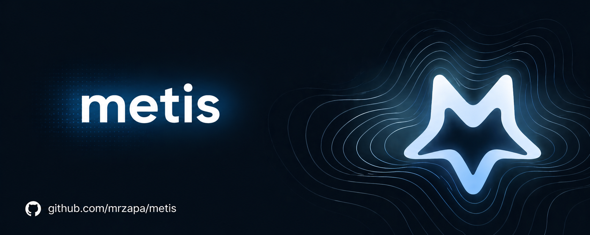
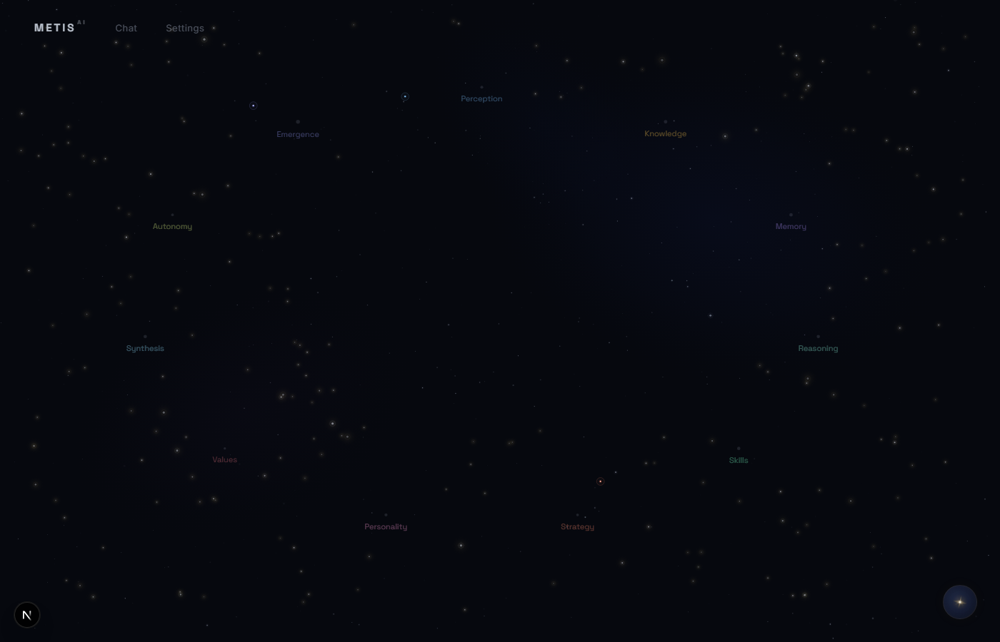
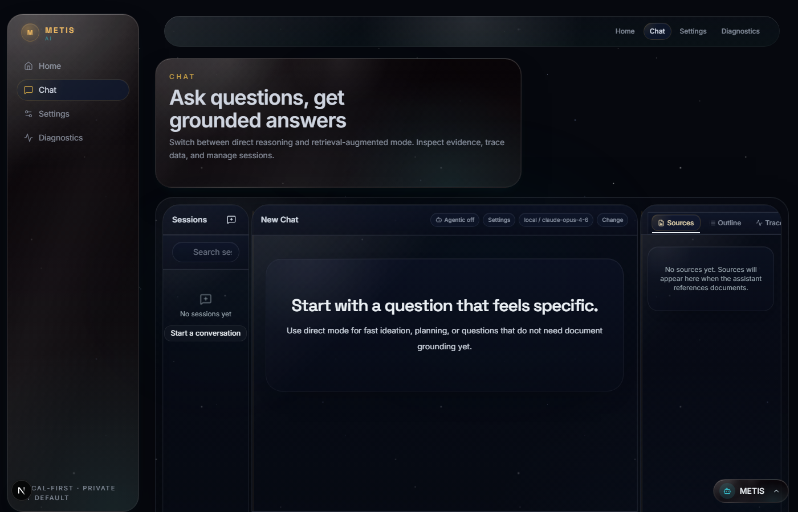
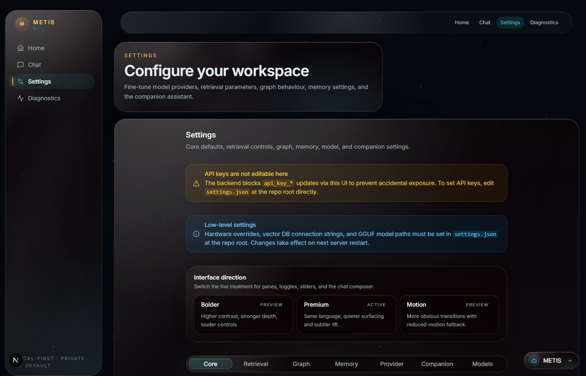
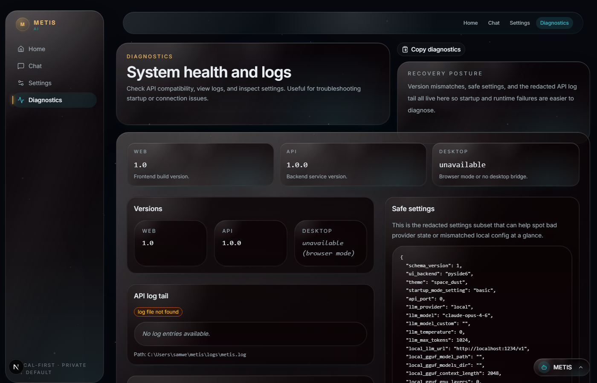

<p align="center">
  
</p>

<h1 align="center">METIS AI</h1>

<p align="center">
  <strong>Grow an AI that actually knows you.</strong><br />
  A local-first living AI workspace where your documents become a navigable knowledge universe, your companion remembers, and every frontier technique stays inspectable.
</p>

<p align="center">
  <a href="https://github.com/mrzapa/metis/actions/workflows/ci.yml"></a>
  <a href="LICENSE"></a>
  
  
</p>

<p align="center">
  <a href="#-quick-start">Quick Start</a> ·
  <a href="#-features">Features</a> ·
  <a href="#-privacy-and-trust">Privacy</a> ·
  <a href="#-commercial-licensing">Licensing</a> ·
  <a href="#-local-development">Development</a> ·
  <a href="#-contributing">Contributing</a>
</p>

---

**METIS AI** is a commercial, local-first AI workspace for people who want an AI that becomes *theirs* instead of another rented cloud assistant. It combines grounded document chat, a constellation-style knowledge map, an always-available companion, and plug-and-play frontier techniques in one inspectable desktop/web product.

| Private by default | A companion that grows | Frontier techniques, plug-and-play |
|--------------------|------------------------|------------------------------------|
| Run with local GGUF models, browser-side WebGPU inference, or your preferred provider. Keep documents, sessions, traces, and memory on your machine. | METIS keeps session context, companion memory, playbooks, and brain links so the workspace compounds around your work. | Q&A, Summary, Tutor, Research, Evidence Pack, Knowledge Search, forecasting, Heretic, Tribev2, swarm, and traceable retrieval live behind one interface. |

> **Intelligence grown, not bought.** Every other AI product rents you a stranger's mind. METIS is built to grow one with you.

## Product Tour

| Constellation home | Evidence-first chat |
|--------------------|---------------------|
|  |  |
| Turn documents, feeds, and sessions into a navigable universe of stars and constellations. | Ask grounded questions, inspect sources, follow trace events, and export evidence-backed work. |

| Settings and model control | Diagnostics and network visibility |
|----------------------------|------------------------------------|
|  |  |
| Swap LLMs, embeddings, vector stores, local models, retrieval depth, and expert features without rewriting the app. | Verify app health and pair it with the Network Audit surface that shows outbound calls and provider provenance. |

## ⚡ Quick Start

### Install

**macOS / Linux:**

```bash
curl -fsSL https://raw.githubusercontent.com/mrzapa/metis/main/scripts/install_metis.sh | bash
```

**Windows (PowerShell):**

```powershell
irm https://raw.githubusercontent.com/mrzapa/metis/main/scripts/install_metis.ps1 | iex
```

The installer clones or updates the repo, creates a virtual environment, installs dependencies, builds the web UI when Node.js is available, and drops a `metis` launcher on your PATH.

### Run

```bash
metis
```

The launcher starts the local Litestar API and static web UI, then opens `http://127.0.0.1:3000`.
By default this lands you on the Constellation home landing page.

You can also run directly from source:

```bash
python main.py
```

| Interface | Command |
|-----------|---------|
| **Web UI** | `metis` |
| **Web UI from source** | `python main.py` |
| **Legacy desktop override** | `metis --desktop` |
| **Legacy desktop override (alias)** | `metis --gui` |
| **CLI** | `metis --cli <command>` |
| **Native desktop shell** | See `apps/metis-desktop/README.md` |

### First Workflow

1. **Build an index** from uploaded files, folders, or an existing manifest.
2. **Ask grounded questions** in Q&A, Summary, Tutor, Research, Evidence Pack, or Knowledge Search mode.
3. **Inspect the answer** through sources, citations, trace events, and exports.
4. **Keep working in context** as sessions, companion reflections, and brain links accumulate locally.

## ✨ Features

### Cosmos: your knowledge as a universe

METIS turns documents, sessions, feeds, and skills into a constellation-style workspace. Indexed sources become stars you can map, inspect, link, and send into grounded chat. The constellation is the primary navigation model, not decorative chrome.

### Companion: an AI that grows with your work

The METIS Companion bootstraps a local identity, reflects on completed work, stores learned memories and playbooks, and surfaces contextual hints from the dock. The default growth story is system-level growth: better memory, richer traces, denser brain links, and accumulated skills. Weight-level continual learning and LoRA fine-tuning are stretch goals, not shipped promises.

### Cortex: every layer stays swappable

Most AI products hardcode their stack. METIS treats each layer as replaceable.

| Layer | Current options | Local/offline path |
|-------|-----------------|--------------------|
| **LLM** | Anthropic, OpenAI, Google, xAI, Cohere, LM Studio, local GGUF | Local GGUF or LM Studio |
| **Companion inference** | Browser-side Bonsai 1.7B WebGPU, optional backend GGUF reflection | WebGPU inference after opt-in model download/cache |
| **Embeddings** | Voyage, Sentence Transformers, local GGUF, provider embeddings | Sentence Transformers or local GGUF |
| **Vector store** | JSON, ChromaDB, Weaviate | JSON by default; Chroma/Weaviate can run locally |

### Six ways to read a corpus

| Mode | What it unlocks |
|------|-----------------|
| **Q&A** | Direct, cited answers from selected documents |
| **Summary** | Condensed overviews for long or complex files |
| **Tutor** | Socratic teaching, flashcards, and guided follow-ups |
| **Research** | Deep dives with sub-query expansion and reranking |
| **Evidence Pack** | Claim-level grounding with source citations |
| **Knowledge Search** | Retrieval-first exploration before synthesis |

### Exportable, inspectable answers

Chat is built around evidence rather than vibes: retrieved sources, citations, run traces, resumable streams, JSON exports, and PowerPoint evidence packs. The point is not just to get an answer, but to understand why METIS produced it.

### Frontier modules in one product surface

METIS keeps ambitious techniques close to the user journey: Heretic model abliteration, TimesFM forecasting, Tribev2 multimodal faculty classification, swarm simulation, recursive retrieval, semantic/structure-aware ingestion, skill derivation from traces, and local model management.

## 👥 Who METIS Is For

- Indie writers, fiction authors, researchers, and creators whose knowledge is their work product.
- Autodidacts, students, analysts, and tinkerers who want to try frontier AI techniques without building a lab.
- Homelabbers, r/LocalLLaMA regulars, and local-model users who want a beautiful interface around their stack.
- Privacy-minded professionals who already care about tools like Obsidian, Kagi, Mullvad, Proton, or Framework.

METIS is **not** chasing enterprise procurement, SOC 2-first buyers, team administration, SSO, or regulated-industry compliance on day one. The product is local, single-user, maximalist, and designed for a solo/lifestyle commercial path.

## Why METIS

| Generic cloud chat or RAG apps | METIS |
|--------------------------------|-------|
| Sessions are mostly stateless and hosted elsewhere. | Sessions, memory, traces, indexes, and companion state live locally by default. |
| Privacy is promised at the policy layer. | Network Audit is designed to show what left the machine and which feature caused it. |
| Retrieval evidence is often hidden or shallow. | Sources, scores, citations, trace events, and exports are first-class. |
| The model/provider stack is usually fixed. | LLMs, embeddings, vector stores, local GGUFs, and WebGPU companion inference are swappable. |
| The UI is a chat box with sidebars. | The constellation and brain graph make knowledge, sessions, skills, and growth navigable. |
| New AI techniques arrive as separate tools. | METIS turns techniques into product modules the companion can learn to use. |

## 🔐 Privacy and Trust

- **Local-first by design.** METIS stores indexes, sessions, traces, companion memory, and settings on your machine.
- **Offline-capable.** Use local GGUF models, local embeddings, and the JSON vector store for fully local operation.
- **Provider calls are explicit.** Remote LLM, embedding, search, model-download, or vector services are opt-in through settings and provider credentials.
- **WebGPU Bonsai is opt-in.** The browser-side Bonsai companion model downloads only when loaded, runs inference on-device, and is cached by the browser after first load when supported.
- **Network Audit is honest, not magic.** The audit layer is a truth surface for outbound calls and SDK invocation provenance; it is not an OS-level firewall.
- **Protected local API when needed.** Set `METIS_API_TOKEN` to require Bearer auth on protected endpoints.
- **Growth claims stay honest.** METIS currently grows through memory, traces, skills, retrieval, and brain links. Weight updates, LoRA fine-tuning, and always-on overnight reflection remain opt-in or roadmap work.

## 💼 Commercial Licensing

METIS is proprietary for releases after `v1.0.0`. Versions up to and including `v1.0.0` were released under MIT; later versions require the license terms in [LICENSE](LICENSE) or a separate written agreement.

Commercial usage rights are available by agreement with the maintainer. The planned business model in [VISION.md](VISION.md) includes Free, Pro, Lifetime, and Supporter tiers, but this README does not publish purchase links or final pricing until the commercial surface exists.

## 🧱 Tech Stack

| Area | Stack |
|------|-------|
| **Primary interface** | Tauri shell around the Next.js web app |
| **Frontend** | Next.js, React, TypeScript, Tailwind, Three.js/WebGL surfaces |
| **Backend** | Litestar ASGI service, Python 3.10+ |
| **Persistence** | SQLite-backed sessions/app state, local files for traces and indexes |
| **Retrieval** | JSON vector store by default; optional ChromaDB and Weaviate paths |
| **Local AI** | llama.cpp/GGUF path, Sentence Transformers, browser WebGPU Bonsai companion |
| **Packaging** | Installer scripts, static web export, Tauri desktop shell |

## 🛠️ Local Development

Install the Python development dependencies from the repo root:

```bash
pip install -e ".[dev,api]"
```

### API only

```bash
python -m metis_app.api_litestar
```

Runs the API at `http://127.0.0.1:8000`. Full API reference is available at `http://127.0.0.1:8000/schema` while the server is running.

### API + Next.js dev UI

**macOS / Linux:**

```bash
bash scripts/run_nextgen_dev.sh
```

**Windows (PowerShell):**

```powershell
.\scripts\run_nextgen_dev.ps1
```

This starts:

- API at `http://127.0.0.1:8000`
- Next.js dev UI at `http://127.0.0.1:3000`

### Native desktop shell

Native desktop packaging lives in `apps/metis-desktop/`. The repo launcher intentionally opens the local web UI; use the Tauri shell when you need a native packaged build.

## 💻 CLI

The CLI shares the same retrieval backend as the app: same indexing and query path, no window.

```bash
# Index a file
metis --cli index --file docs/my_notes.txt

# Query it
metis --cli query --file docs/my_notes.txt --question "What are the key takeaways?"
```

You can also run the same CLI entrypoint from source:

```bash
python main.py --cli index --file docs/my_notes.txt
python main.py --cli query --file docs/my_notes.txt --question "What are the key takeaways?"
```

## 🔧 Advanced Configuration

METIS ships with defaults in `metis_app/default_settings.json`. Copy values into `settings.json` at the repo root to override them.

### Environment variables

| Variable | What it does |
|----------|-------------|
| `NEXT_PUBLIC_METIS_API_BASE` | Overrides the API base URL used by the web UI during local Next.js development |
| `NEXT_PUBLIC_METIS_API_TOKEN` | Browser-side Bearer token; must match `METIS_API_TOKEN` when auth is enabled |
| `METIS_API_TOKEN` | Requires Bearer auth on protected local API endpoints |
| `METIS_API_CORS_ORIGINS` | Overrides allowed CORS origins |
| `METIS_ALLOW_API_KEY_WRITE` | Allows settings API key writes when set to `1`; disabled by default |
| `METIS_TEST_WEAVIATE_URL` | Weaviate endpoint for live parity tests |
| `METIS_TEST_WEAVIATE_API_KEY` | Weaviate API key |
| `METIS_TEST_WEAVIATE_GRPC_HOST` | Weaviate gRPC host |
| `METIS_TEST_WEAVIATE_GRPC_PORT` | Weaviate gRPC port |
| `METIS_TEST_WEAVIATE_GRPC_SECURE` | Enable TLS for gRPC |

### Native brain pass

`enable_brain_pass` keeps METIS's placement and source-normalisation pass enabled. `brain_pass_native_enabled` allows native Tribev2 analysis when the runtime is installed, and `brain_pass_native_text_enabled` keeps text-backed sources on the native path by default.

```json
{
  "enable_brain_pass": true,
  "brain_pass_native_enabled": true,
  "brain_pass_native_text_enabled": true
}
```

Set `brain_pass_native_text_enabled` to `false` if you want text, document, or image uploads to stay on the lightweight fallback path. Audio and video inputs can still use native analysis when `brain_pass_native_enabled` is on and the runtime is available.

### Forecast on Windows

TimesFM 2.5 currently works best in a dedicated Python 3.11 environment on Windows. METIS includes a helper script that reproduces the validated setup and starts the Litestar backend with forecast support enabled:

```powershell
.\scripts\run_forecast_api_dev.ps1
```

Then run the web UI separately:

```powershell
cd apps/metis-web
pnpm dev
```

Forecast mode defaults to a near-max 15,360-point context window and a 1k horizon cap instead of the older 1k / 256 defaults.

## 🧪 Testing

Run checks from the repo root:

```bash
ruff check .
python -m pytest
python -m pytest --cov=metis_app --cov-report=term
```

For full dev verification:

```bash
./scripts/dev_check.sh
```

```powershell
.\scripts\dev_check.ps1
```

## 📁 Project Layout

```text
metis_app/
├── api_litestar/   # Litestar routes (v1/*)
├── engine/         # Indexing + retrieval core boundaries
├── models/         # BrainGraph, AppModel, session types
├── services/       # Session repository, index service, pipeline
└── utils/          # Knowledge graph, LLM/embedding providers

apps/
├── metis-web/      # Next.js web UI (TypeScript + Tailwind)
│   ├── app/
│   │   ├── chat/        # Grounded chat workspace
│   │   ├── brain/       # Interactive Brain Graph visualization
│   │   ├── gguf/        # Local model management
│   │   ├── library/     # Indexed content surfaces
│   │   ├── setup/       # First-run onboarding wizard
│   │   └── settings/    # Provider and model configuration
│   └── components/
│       ├── brain/       # BrainGraph 3D component
│       ├── chat/        # Chat + evidence panels
│       ├── constellation/
│       └── shell/       # METIS Companion dock, page chrome
└── metis-desktop/  # Tauri desktop shell around metis-web

scripts/            # Installers and dev scripts
skills/             # Self-contained agentic skill workflows
tests/              # pytest suite
docker/             # Weaviate for integration testing
docs/adr/           # Architecture decisions
```

## 🤝 Contributing

```bash
pip install -e ".[dev,api]"
ruff check .
python -m pytest
```

Keep PRs focused, include tests for behavior changes, update docs for user-visible changes, and make sure CI passes before requesting review. See [CONTRIBUTING.md](CONTRIBUTING.md) for details.

## License

METIS is released under the proprietary license in [LICENSE](LICENSE).

Licensing cutover:

- Versions up to and including `v1.0.0` were released under MIT.
- Versions after `v1.0.0` are proprietary unless covered by a separate written license agreement.
